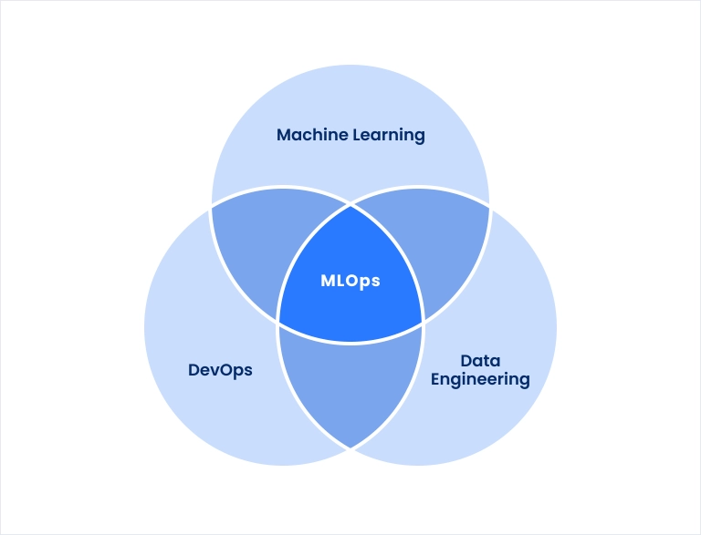

# Data Science and MLOps Landscape in Industry



## Overview
This repository contains a detailed report analyzing the **Data Science and MLOps landscape in industry**, based on the *2022 Kaggle Machine Learning & Data Science Survey*. Authored by Yash J, the project explores AI adoption, enterprise tech stacks, cloud platforms, ML tools, job roles, skills, and salary insights. It aims to provide a comprehensive view of how organizations leverage data science and operationalize machine learning in 2022.

## Key Objectives
- **AI Adoption**: Assess the state of Machine Learning adoption in enterprises.
- **Tech Stack**: Identify popular tools, frameworks (e.g., TensorFlow, PyTorch), and languages (e.g., Python, SQL, R).
- **Cloud Platforms**: Evaluate usage of AWS, Google Cloud, and Azure for ML operations.
- **Transfer Learning**: Examine its impact in business environments.
- **AI Careers**: Highlight top job roles, required skills, team sizes, and education levels.
- **Salary Trends**: Provide insights into compensation across roles, industries, and regions.

## Key Findings
- **ML Adoption**: 32.8% of organizations have ML models in production, while 21.7% haven’t started exploring AI.
- **Industry Leaders**: Internet-based services, insurance, and tech companies lead in AI adoption.
- **Company Size**: Larger firms (1,000+ employees) outpace smaller ones in AI implementation.
- **Tech Stack**: 
  - **Languages**: Python (79.9%), SQL, and R (21.2%) dominate.
  - **Frameworks**: Scikit-learn, TensorFlow, and Keras are top choices.
  - **Cloud**: 45% use cloud platforms, with AWS and GCP leading.
- **Transfer Learning**: Widely used in computer vision, less so in NLP.
- **Hardware**: Only 31% use specialized hardware (e.g., GPUs) for ML training.
- **Jobs**: Data Scientists (21%) and Data Analysts (16.6%) are the most common roles.
- **Skills**: Python, SQL, and cloud expertise are critical.
- **Education**: 43.5% hold Master’s degrees.
- **Salaries**: Data Architects earn the highest median ($65K), followed by Managers ($55K).

## Methodology
- **Data Source**: 2022 Kaggle ML & Data Science Survey (23,997 respondents).
- **Sample**: Filtered to 9,094 professionals (37.9%) who are:
  - Not students (Q5: "No").
  - Employed (Q23: Not "Currently not employed").
  - Specified an industry (Q24 answered).
- **Analysis**: Focused on trends in ML adoption, tools, roles, and salaries, with outlier checks for robustness.

## Tools & Technologies
- **Languages**: Python, SQL, R
- **Frameworks**: TensorFlow, PyTorch, Scikit-learn
- **Visualization**: Matplotlib, Seaborn, Plotly
- **Cloud**: AWS, Google Cloud, Azure
- **Data Source**: Kaggle Survey 2022

## How to Use This Repository
1. **Clone the Repository**:
   ```bash
   git clone https://github.com/yashgithubcom/Data-Science-and-MLOps-Landscape-in-Industry.git
   ```

## References
- McKinsey: The State of AI in 2021
- 2022 Kaggle ML & DS Survey
- Global Cloud Computing Market Report 2022

## About the Author
- **Name**: Yash J
- **Role**: Data Analyst
- **GitHub**: [yashgithubcom](https://github.com/yashgithubcom)

## License
This project is licensed under the **MIT License**. Feel free to use and adapt the content with attribution.

